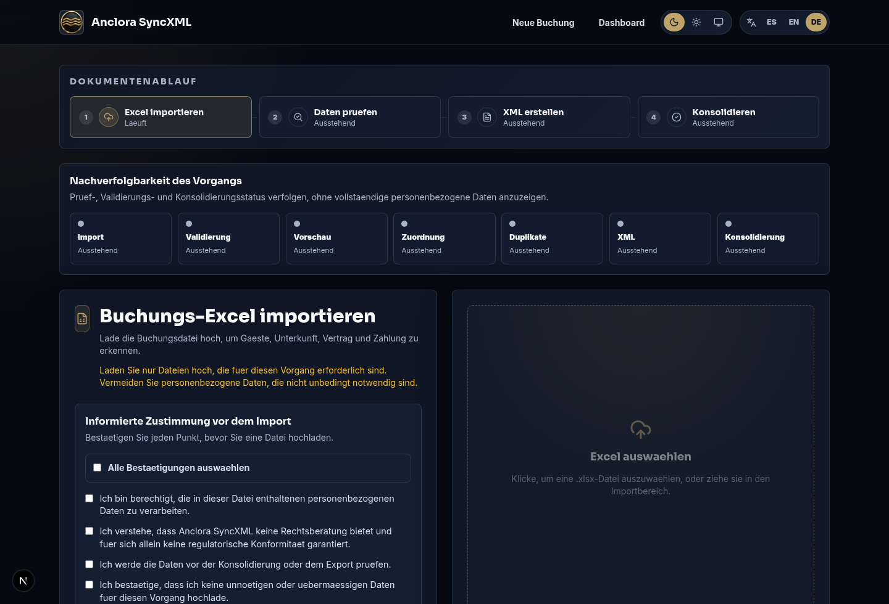
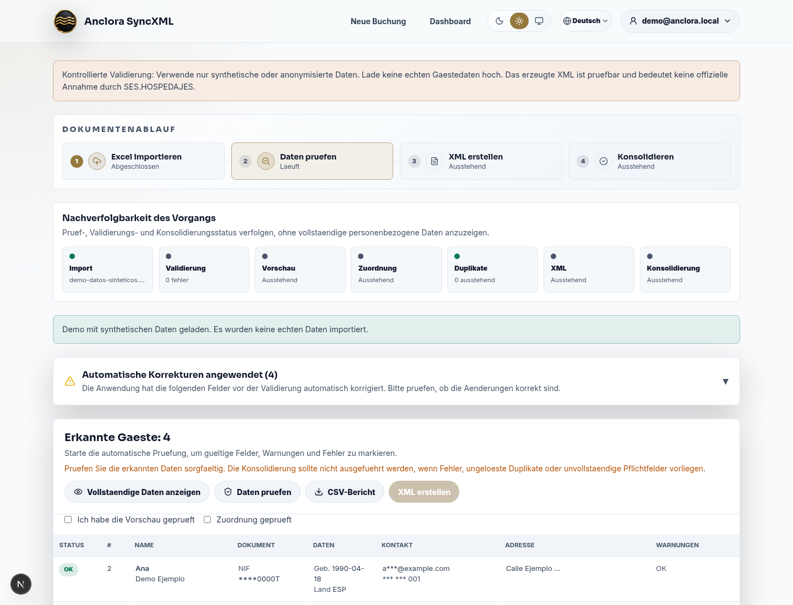
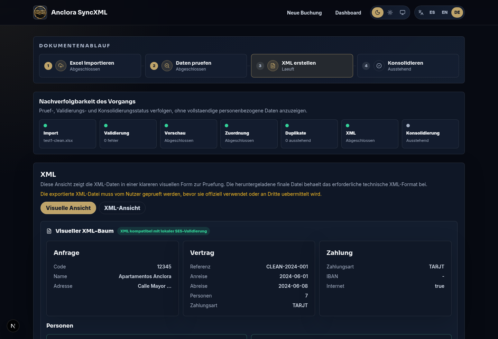
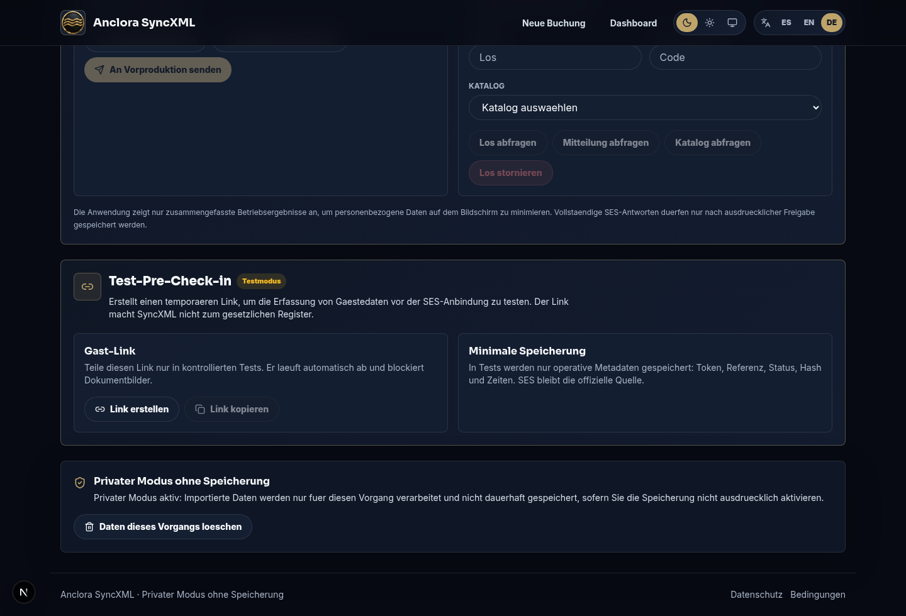
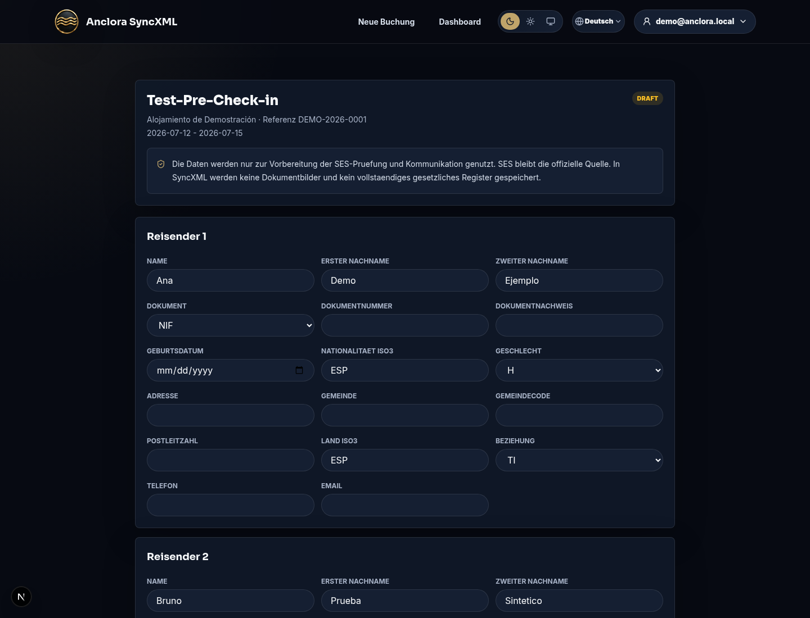
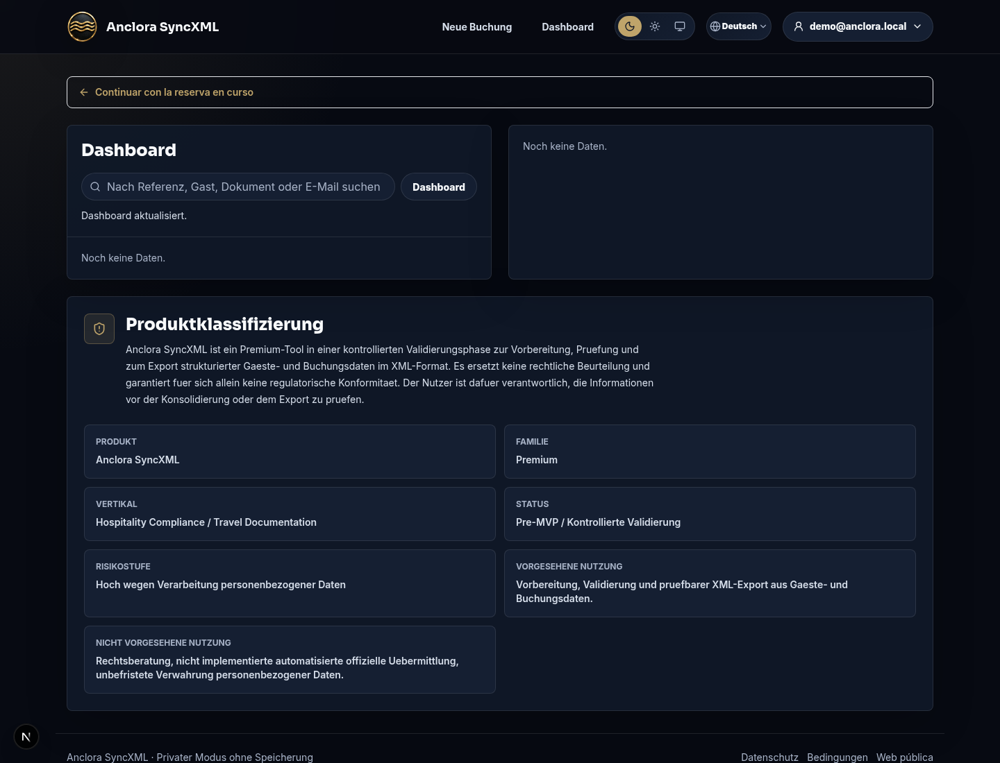

Anclora SyncXML

Benutzerhandbuch

Premium-Leitfaden fuer kontrollierten Pilotbetrieb, Buchungsvalidierung, SES.HOSPEDAJES-XML und Datenschutzkontrollen

  
Version 1.1

  
20. Juli 2026

SyncXML bereitet strukturierte Daten fuer den SES.HOSPEDAJES-Ablauf vor, validiert und exportiert sie. Es ersetzt weder menschliche Pruefung, offizielles Portal, Vorproduktionsnachweise noch die rechtliche Bewertung des Verantwortlichen.

## Inhaltsverzeichnis

| Nr. | Abschnitt | Hauptkontrolle |
| --- | --- | --- |
| 01 | Produktumfang | Kontrollierter Pilot und vorsichtige Aussagen |
| 02 | Zugriff und Sitzungen | Freigegebener Login, temporaeres Passwort und Logout |
| 03 | Vor dem Import | Mindestdaten und private Umgebung |
| 04 | Dokumentenimport | Bestaetigungen und Dateigrenze |
| 05 | Gefuehrte Pruefung | Fehler, Hinweise und Korrekturen |
| 06 | XML und Download | Sperren vor Export |
| 07 | SES und Pre-Check-in | Vorproduktion und Rollenrechte |
| 08 | Operatives Dashboard | Benutzerbezogener Verlauf |
| 09 | Pilot-Feedback | Hinweise ohne Gaestedaten |
| 10 | Sicherheit und Datenschutz | Taegliche Kontrollen |
| 11 | Haeufige Vorfaelle | Operative Reaktion |
| 12 | Glossar | Schluesselbegriffe |

## 1. Produktumfang

**Anclora SyncXML** wandelt eine Buchungs-Excel in pruefbare Daten und XML fuer den SES.HOSPEDAJES-Ablauf um. Die Anwendung ist fuer kontrollierte Validierung, weniger operative Fehler und Arbeit mit sensiblen Daten nach dem Minimierungsprinzip ausgelegt.

Die aktuelle Version wird in einem **kontrollierten Pilot** genutzt. Zugriff erfolgt nach manueller Pruefung und bedeutet keine automatische Freigabe, keine rechtliche Garantie und keine produktive SES-Uebermittlung.

### Was unterstuetzt wird

| Bedarf | Wie SyncXML hilft |
| --- | --- |
| Buchungen importieren | Liest `.xlsx` und erkennt Buchung, Unterkunft, Zahlung und Reisende. |
| Daten validieren | Markiert Fehler und Hinweise vor XML-Erzeugung. |
| Felder korrigieren | Ergaenzt SES-Pflichtfelder in der gefuehrten Pruefung. |
| XML vorbereiten | Erstellt visuelle und technische Ansicht zur Pruefung. |
| SES testen | Bietet lokale Validierung und assistierte Vorproduktionsaktionen. |
| Verlauf pruefen | Speichert benutzerbezogene Buchungen, wenn Persistenz aktiv ist. |
| Feedback sammeln | Sendet Pilot-Feedback ohne Abfrage von Gaestedaten. |

### Wichtige Grenzen

- Es ersetzt nicht das offizielle SES-Portal oder offizielle Dienste.
- Es bietet keine Rechtsberatung und keine absolute Compliance-Garantie.
- Es darf nicht mit SES-Produktion genutzt werden ohne Tests, Zugangsdaten und operative Freigabe.
- Es speichert keine Bilder von Ausweisen oder Reisepaessen.
- Es genehmigt Pilotanfragen nicht automatisch.

---

## 2. Zugriff und Sitzungen

Der Zugriff ist freigegebenen Pilotnutzern oder autorisierten Administratoren vorbehalten.

### Zugriff fuer Pilotnutzer

1. Oeffnen Sie `/login` oder klicken Sie auf **Anmelden** auf der Landingpage.
2. Geben Sie freigegebene E-Mail und Passwort ein.
3. Bei temporaerem Passwort legen Sie vor dem Eintritt ein neues Passwort fest.
4. Pruefen Sie, dass Ihre Sitzungs-E-Mail im Header erscheint.
5. Nutzen Sie **Anwendung schliessen**; die App bereinigt lokalen Sitzungsstatus und kehrt zum Login zurueck.

### Administratorzugriff

| Bereich | Nutzung |
| --- | --- |
| `/admin/login` | Versteckter Login fuer Admin-Profile. |
| Internes Provisioning | Pilotzugangsdaten anlegen oder rotieren. |
| SES | Uebermittlungsaktionen sind nach Rolle und Konfiguration beschraenkt. |

### Sitzungskontrollen

- Pilot-Zugangsdaten nicht teilen.
- Temporaeres Passwort beim ersten Zugriff aendern.
- Nach PII-Pruefung abmelden.
- Wenn der verbundene Nutzer nach Login nicht im Header erscheint, Anwendung neu laden und erneut anmelden.

---

## 3. Vor dem Import

Vor dem Upload pruefen Sie, ob der Fall zum Pilot passt.

### Sie benoetigen

- Buchungs-Excel im Format `.xlsx`.
- Berechtigung zur Verarbeitung der enthaltenen personenbezogenen Daten.
- Unterkunftsdaten und Einrichtungscode, wenn an SES kommuniziert werden soll.
- Reisedaten: Dokument, Geburtsdatum, Nationalitaet, Adresse, Kontakt und Beziehung.
- Interne Vorgaben, wer XML prueft und freigibt.

### Kontrollen vor dem Import

| Kontrolle | Erwartete Aktion |
| --- | --- |
| Private Umgebung | Nicht geteilten Bildschirm nutzen und PII nicht unnoetig zeigen. |
| Mindestdatei | Nur die fuer den Vorgang erforderliche Excel hochladen. |
| Echte Daten | Im Pilot synthetische oder anonymisierte Daten bevorzugen, ausser ausdruecklich freigegeben. |
| Optionale Probe | Pilot kann ohne eigene Probe beantragt werden; das bedeutet keine automatische Zustimmung zu synthetischen Daten. |
| Nachvollziehbarkeit | Festlegen, wer prueft und welche Nachweise behalten werden. |

---

## 4. Dokumentenimport

Der Import startet den operativen Ablauf und wendet Kontrollen vor dem Lesen der Datei an.

### Schritte

1. Informierte Bestaetigungen lesen.
2. **Alle Bestaetigungen auswaehlen** oder einzelne Checkboxen aktivieren.
3. `.xlsx`-Datei auswaehlen.
4. **Importieren** klicken.

### Automatische Kontrollen

| Kontrolle | Ergebnis |
| --- | --- |
| Erlaubte Erweiterung | Nur unterstuetzte Formate werden akzeptiert. |
| Maximale Groesse | Zu grosse Dateien werden vor Verarbeitung abgelehnt. |
| Validierte Nutzlast | Das geparste Ergebnis wird vor Fortsetzung validiert. |
| INE-Gemeinden | Bei verfuegbarer Datenbank werden Gemeindecodes aufgeloest. |
| Duplikate | Verdaechtige Datensaetze erscheinen zur manuellen Entscheidung. |

Ist die Datei ungueltig, leer oder nicht lesbar, zeigt die Anwendung einen Fehler und geht nicht zu XML weiter.

---

## 5. Gefuehrte Pruefung

Die gefuehrte Pruefung ermoeglicht Korrekturen vor XML-Erzeugung.

### Hauptelemente

| Element | Nutzung |
| --- | --- |
| Gaestetabelle | Name, Dokument, Nationalitaet, Kontakt und Status pruefen. |
| Vollstaendige Daten anzeigen | Zeigt unmaskierte Daten nur in privater Umgebung. |
| Daten validieren | Fuehrt intelligente und implementierte SES-Regeln aus. |
| CSV-Bericht | Exportiert Vorfaelle nach Buchung und Reisendem. |
| Gefuehrte Pruefung | Ergaenzt Pflichtfelder oder korrigiert Hinweise. |
| Duplikate | Erlaubt Ueberspringen, Behalten oder Pruefen verdaechtiger Saetze. |

### Validierungsstatus

| Status | Bedeutung | Fortfahren? |
| --- | --- | --- |
| Gueltig | Feld ist korrekt oder fuer aktuellen Ablauf ausreichend. | Ja |
| Hinweis | Sollte geprueft werden; blockiert nicht immer. | Fallweise |
| Fehler | Blockiert XML, Download oder Konsolidierung. | Nein |

### Felder mit haeufigem Pruefbedarf

- INE-Gemeindecode fuer spanische Adressen.
- Dokumenttraeger fuer NIF/NIE.
- Geschlecht und Beziehung gemaess MIR-Katalogen.
- Telefon oder E-Mail.
- Zweiter Nachname, falls erforderlich.
- Postleitzahl und Adresse.

---

## 6. XML und Download

Wenn kritische Fehler korrigiert sind, klicken Sie auf **XML erzeugen**. Die Anwendung erstellt eine visuelle und eine technische Ansicht.

### Pruefung vor Download

| Block | Was pruefen |
| --- | --- |
| Anfrage | Einrichtungscode, Name und Adresse. |
| Vertrag | Referenz, Anreise, Abreise, Personen und Zahlung. |
| Zahlung | Zahlungsart, maskierte IBAN und Internetangabe. |
| Personen | Enthaltene Reisende, maskiertes Dokument und Kontakt. |
| XML-Vorfaelle | Struktur-, Namespace- oder Pflichtfeldfehler. |

### Download

Der Dateiname nutzt folgendes Format:

`syncxml-buchungsnummer-DDMMJJHH24MISS.xml`

Der Download ist gesperrt, solange kritische Vorfaelle bestehen. Bleiben nur Hinweise, pruefen Sie diese und behalten interne Entscheidungsnachweise.

---

## 7. SES und Pre-Check-in

SyncXML enthaelt assistierte SES-Aktionen. Verfuegbarkeit haengt von Zugangsdaten, Umgebung und Rolle ab.

| Aktion | Kontrolle |
| --- | --- |
| SES-XML validieren | Lokale Validierung gegen implementierte Regeln. |
| Simulation vorbereiten | Bereitet Anfrage vor, ohne Daten an das Ministerium zu senden. |
| An Vorproduktion senden | Nur mit konfigurierten Zugangsdaten und erlaubtem Nutzer. |
| Los/Mitteilung abfragen | Erfordert Zugangsdaten und Tracking-Code. |
| Katalog abfragen | Prueft offizielle Kataloge, wenn SES konfiguriert ist. |
| Produktion | Standardmaessig blockiert bis Freigabe und Nachweise vorliegen. |

Pilotnutzer duerfen nicht an SES senden. Uebermittlungsrouten wenden Rollenkontrolle an und schlagen sicher fehl, wenn die Konfiguration die Aktion nicht erlaubt.

### Test-Pre-Check-in

Das Pre-Check-in-Panel erstellt temporaere Links, damit Reisende Daten vor der Pruefung ergaenzen.

Aktuelle Kontrollen:

- Temporaerer Link mit Ablauf.
- Token wird als Hash gespeichert.
- Keine Dokumentbilder.
- Kein vollstaendiges gesetzliches Register.
- Operativer Status: ausstehend, eingereicht, abgelaufen oder widerrufen.
- Menschliche Pruefung vor offizieller Nutzung.

---

## 8. Operatives Dashboard

Das Dashboard erlaubt Suche, Statuspruefung und XML-Download, wenn der konfigurierte Speichermodus dies erlaubt.

### Verlaufskontrollen

| Kontrolle | Beschreibung |
| --- | --- |
| Benutzerisolation | Jeder Nutzer sieht nur eigene persistierte Buchungen. |
| Suche | Filtert nach Referenz oder Unterkunft. |
| Detail | Zeigt Daten, Personen und erkannte Reisende. |
| XML-Download | Nutzt die geschuetzte Route der gewaehlten Buchung. |
| Loeschung | Loescht die fuer den aktuellen Nutzer zugaengliche Buchung. |
| Offene Sitzung | Erlaubt Fortsetzen eines lokalen Vorgangs. |

Daten werden als `TT/MM/JJJJ` angezeigt. Wenn eine Uhrzeit vorhanden ist, als `TT/MM/JJJJ HH:MM:SS`.

---

## 9. Pilot-Feedback

Die Anwendung enthaelt Feedback waehrend der Nutzung und beim Schliessen.

### Was gesendet werden sollte

| Feedbacktyp | Nuetzliches Beispiel |
| --- | --- |
| Operative Reibung | "Die Gemeindekorrektur war langsam." |
| Qualitaet der Validierung | "Der Beziehungshinweis war nicht klar." |
| Pilotergebnis | "Ich konnte pruefbares XML mit synthetischen Daten erzeugen." |
| Naechster Bedarf | "Ich brauche eine Vorlage fuer mein PMS." |

### Was nicht gesendet werden darf

- Namen, Dokumente, Telefone oder E-Mails von Gaesten.
- XML mit echten Daten.
- Screenshots mit sichtbarer PII.
- Geheimnisse, Zugangsdaten oder Tokens.

Feedback geht an den konfigurierten Anclora-Teamkanal und ersetzt keinen formalen rechtlichen oder technischen Support.

---

## 10. Sicherheit und Datenschutz

SyncXML verarbeitet personenbezogene Informationen. Nutzen Sie diese taeglichen Kontrollen:

| Kontrolle | Grund |
| --- | --- |
| Daten minimieren | Exposition und Risikoflaeche reduzieren. |
| Standardmaessig maskieren | Unnoetige Sichtbarkeit von Dokumenten und Kontakt vermeiden. |
| Vor Export pruefen | Fehler vor offizieller Nutzung verhindern. |
| Keine Bilder speichern | Ausweis-/Passbilder liegen ausserhalb aktueller Speicherung. |
| Vorproduktion nutzen | SES vor echten Vorgaengen testen. |
| Temporaere Vorgaenge bereinigen | Testbuchungen nach Abschluss loeschen. |
| Zugriff kontrollieren | Nur freigegebene Nutzer sollen Buchungen mit PII oeffnen. |
| Sensible Logs vermeiden | PII nicht in Vorfaelle, Chats oder Tickets kopieren. |

> SyncXML bietet keine Rechtsberatung. Der Verantwortliche muss Datenschutz, DPA, Aufbewahrung und Betriebsverfahren freigeben.

---

## 11. Haeufige Vorfaelle

| Vorfall | Empfohlene Aktion |
| --- | --- |
| Anmeldung nicht moeglich | Freigegebene E-Mail, Passwort und Kontostatus pruefen. |
| Passwortaenderung verlangt | Es ist ein temporaeres Passwort; vor Fortsetzung neues festlegen. |
| Excel importiert nicht | Erweiterung, Groesse, Struktur und Inhalt pruefen. |
| Gemeindecode fehlt | INE-Code in der gefuehrten Pruefung ergaenzen. |
| Kritische Fehler bleiben | Vor XML-Erzeugung oder Download korrigieren. |
| SES lehnt Test ab | Antwort, Los/Mitteilung und Fehlerblock aufbewahren. |
| Buchung nicht sichtbar | Mit demselben Nutzer anmelden, der sie konsolidiert hat. |
| Echte Daten erforderlich | Erfordert Berechtigung, private Umgebung und vorherige operative Freigabe. |

---

## 12. Glossar

| Begriff | Bedeutung |
| --- | --- |
| SES | Offizielles System fuer Beherbergungsmitteilungen. |
| XML | Strukturierte Datei mit Buchung und Reisenden. |
| Vorproduktion | Testumgebung vor Produktion. |
| RBAC | Rollenbasierte Zugriffskontrolle. |
| Owner | Nutzer, dem eine persistierte Buchung gehoert. |
| Hash | Technischer Fingerabdruck zur Identifikation ohne Originalwert. |
| DPA | Vertrag zur Auftragsverarbeitung. |
| PII | Personenbezogene identifizierbare Informationen. |
| INE | Spanisches Statistikamt; Quelle fuer Gemeindecodes. |

Anclora SyncXML · Benutzerhandbuch · Version 1.1 · 20. Juli 2026

