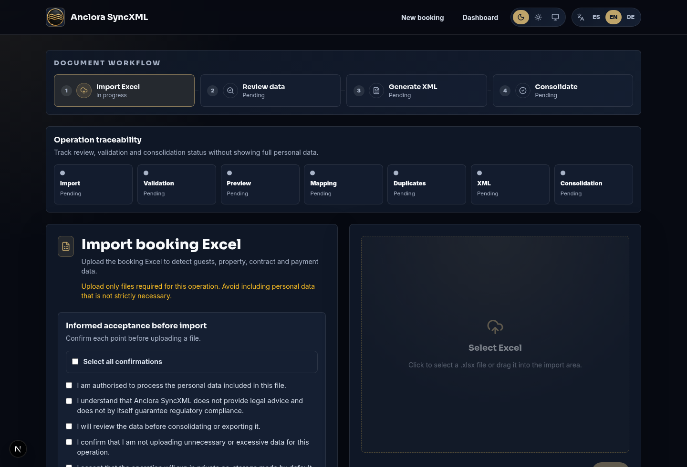
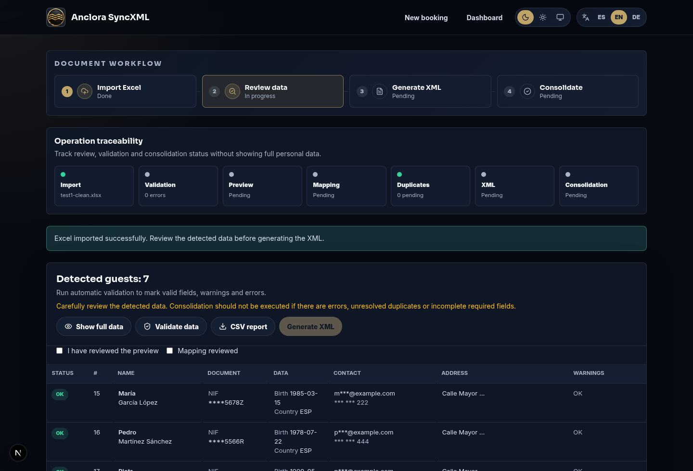
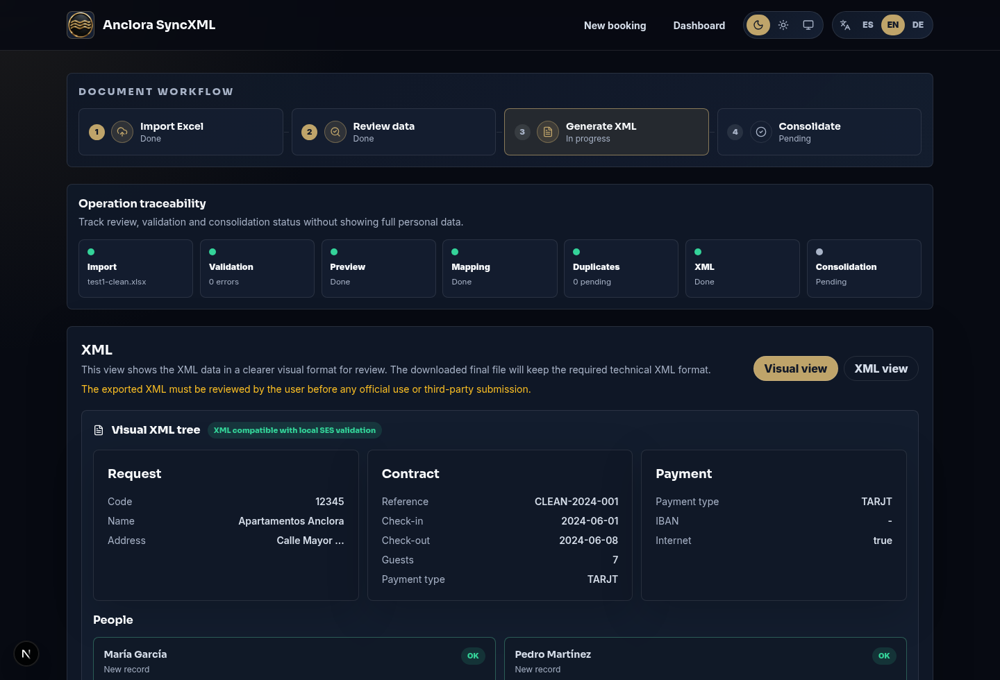
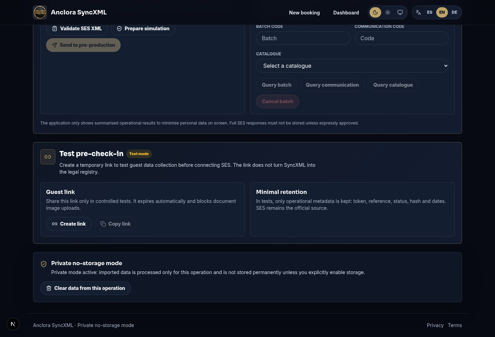
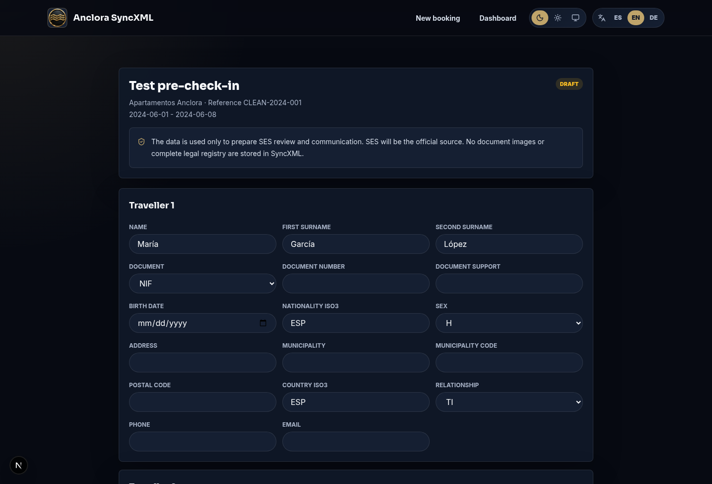
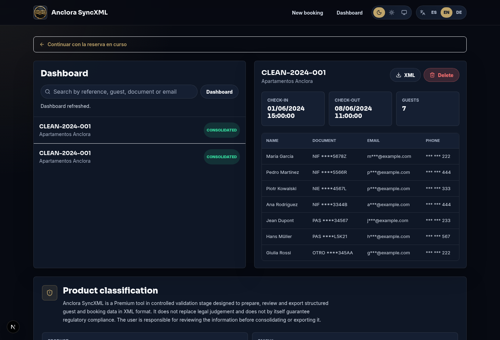

Anclora SyncXML

User Manual

Practical guide to import bookings, validate guest data, generate XML and prepare SES tests

  
Version 1.0

  
24 May 2026

SyncXML prepares, validates and exports structured data for the SES.HOSPEDAJES workflow. It does not replace human review or the controller's legal judgement.

## Table of contents

| No. | Section | Page |
| --- | --- | ---: |
| 01 | What is Anclora SyncXML | 3 |
| 02 | Before you start | 5 |
| 03 | Document workflow | 6 |
| 04 | Review and smart validation | 9 |
| 05 | XML generation, review and download | 12 |
| 06 | SES services and test pre-check-in | 15 |
| 07 | Dashboard and operational history | 18 |
| 08 | Privacy, security and good practices | 21 |
| 09 | Frequently asked questions | 23 |
| 10 | Quick glossary | 25 |

## 1. What is Anclora SyncXML

**Anclora SyncXML** is a premium application that transforms a booking Excel file into a reviewable, validated XML prepared for the SES.HOSPEDAJES operational workflow.

The application is designed for sensitive guest data with a minimisation approach: first review, then correct, and only then generate or download the XML.

### What it is for

| Need | How SyncXML helps |
| --- | --- |
| Import bookings | Reads the Excel file and detects booking, property, payment and travellers. |
| Validate data | Marks errors and warnings before XML generation. |
| Correct fields | Lets you complete SES-required fields through guided review. |
| Generate XML | Creates one XML per booking with a normalised filename and timestamp. |
| Review before sending | Shows a visual view and the technical XML. |
| Prepare SES | Includes local validation, simulation and pre-production controls. |
| Test pre-check-in | Generates temporary test links to complete traveller data. |

### What it does not do

- It does not replace the official SES portal or services.
- It should not be used as the complete legal registry if SES is the authoritative source.
- It does not store ID card or passport images.
- It does not send to production without configuration and pre-production evidence.

---

## 2. Before you start

Before using SyncXML, define the operational scope.

### You need

- Booking Excel file in `.xlsx` format.
- Authorisation to process the personal data included in the file.
- Property data and establishment code if the booking will be communicated to SES.
- Complete traveller data: document, birth date, nationality, address, contact and relationship.
- Internal criteria for who reviews and approves the XML before official use.

### Recommendations

| Topic | Recommendation |
| --- | --- |
| Environment | Work on a private screen and avoid exposing unnecessary personal data. |
| File | Upload only the Excel needed for the operation. |
| Review | Do not download or consolidate if critical errors remain. |
| SES | Use pre-production first and keep acceptance/rejection evidence. |
| Pre-check-in | In tests, use temporary links and avoid real data unless authorised. |

---

## 3. Document workflow

The main workflow has four visible phases:

| Phase | Goal |
| --- | --- |
| Import Excel | Select the file and accept the informed confirmations. |
| Review data | Check travellers, booking, contract and validations. |
| Generate XML | Create the XML and review it visually. |
| Consolidate | Save the operation in the configured mode and allow later download. |

The **operation traceability** band shows import, validation, preview, mapping, duplicates, XML and consolidation status without exposing full personal data.

### Import an Excel file

1. Review the informed confirmations.
2. Tick **Select all confirmations** or each checkbox individually.
3. Select the `.xlsx` file.
4. Click **Import**.

If the file is invalid, empty, too large or unreadable, the application shows an error before continuing.

---

## 4. Review and smart validation

The review phase lets you understand what the application has detected before any XML is generated.

### Main elements

| Element | Use |
| --- | --- |
| Guest table | Review name, document, nationality, contact and validation status. |
| Show full data | Reveals unmasked data only when you are in a private environment. |
| Validate data | Runs smart validation. |
| CSV report | Downloads an issue and status report by booking and traveller. |
| Guided review | Completes mandatory SES fields or corrects warnings. |
| Duplicates | Decide whether to skip, keep or manually review suspicious records. |

### Validation colours

| Status | Meaning |
| --- | --- |
| Valid | Field is correct or sufficient for the current flow. |
| Warning | Should be reviewed, but may not block the XML. |
| Error | Blocks generation, download or consolidation until fixed. |

### Fields that often need review

- INE municipality code for Spanish addresses.
- Document support for NIF/NIE.
- Sex and relationship.
- Phone or email contact.
- Second surname where applicable.
- Postal code and address.

---

## 5. XML generation, review and download

Once critical errors are fixed, click **Generate XML**. The application creates a visual view and a technical view.

### Visual view

The visual view organises the XML into blocks:

| Block | Content |
| --- | --- |
| Request | Establishment code, name and address. |
| Contract | Reference, check-in, check-out, people and payment. |
| Payment | Payment type, masked IBAN and internet flag. |
| People | Included travellers, masked document and contact. |

### XML view

The XML view shows the technical content that will be downloaded. It must be reviewed before official use.

### XML download

The downloaded filename uses this format:

`syncxml-bookingNumber-DDMMYYHH24MISS.xml`

Download is blocked if critical XML issues remain.

---

## 6. SES services and test pre-check-in

SyncXML includes an assisted SES services panel:

| Action | Description |
| --- | --- |
| Validate SES XML | Runs local validation against implemented SES rules. |
| Prepare simulation | Prepares a request without sending data to the Ministry. |
| Send to pre-production | Available only when credentials are configured. |
| Query lot/communication | Requires pre-production credentials. |
| Query catalogue | Lets you inspect official catalogues when SES is configured. |

Production remains blocked until controlled testing is complete.

### Test pre-check-in

The test pre-check-in panel creates a temporary link to complete traveller data before review.

In this mode:

- The link is temporary.
- No document images are stored.
- No complete legal registry is created.
- Only operational metadata is kept: token, reference, status, hash and dates.
- SES remains the official source when the real communication is performed.

---

## 7. Dashboard and operational history

The dashboard lets you search bookings, review status and download XML again when the configured storage mode allows it.

### Main cards

| Card | Information |
| --- | --- |
| Booking list | Reference, property and status. |
| Detail | Check-in, check-out, people and detected travellers. |
| Actions | Download XML or delete the booking. |
| Product classification | Reminder of product scope and usage limits. |

### Dates

Dates are displayed as `DD/MM/YYYY`. If a time exists, they are displayed as `DD/MM/YYYY HH:MM:SS`.

---

## 8. Privacy, security and good practices

SyncXML handles personal information. Use these operational rules:

| Rule | Reason |
| --- | --- |
| Minimise data | Upload only what is needed for the communication. |
| Review before export | Avoid errors before official use. |
| Do not store images | ID card/passport images must not be stored in SyncXML. |
| Use pre-production | Test SES before any real operation. |
| Clear temporary operations | Use the clear button when a review is finished. |
| Control access | Only authorised users should open bookings with PII. |

> SyncXML does not provide legal advice. The controller must approve privacy, DPA, retention and operating procedure.

---

## 9. Frequently asked questions

### Can I generate XML with errors?

No. Critical errors block generation, download or consolidation until they are fixed.

### What happens if the municipality code is missing?

For Spanish addresses, SES requires the INE municipality code. Guided review lets you complete it.

### Can I submit to SES from the application?

In pre-production, once credentials and configuration are available. Production remains blocked by default.

### Is pre-check-in production-ready?

No. It is implemented in test mode to validate the flow before using real data or enabling persistence.

### Are scanned documents stored?

No. The current policy blocks ID card and passport images.

---

## 10. Quick glossary

| Term | Meaning |
| --- | --- |
| SES | Official system used for hospitality communications. |
| XML | Structured file containing booking and traveller data. |
| Pre-production | Test environment before production. |
| Hash | Technical fingerprint used to identify a submission without storing all content. |
| DPA | Data processing agreement. |
| PII | Personally identifiable information. |
| INE | Spanish National Statistics Institute; source for municipality codes. |

Anclora SyncXML · User Manual · Version 1.0

