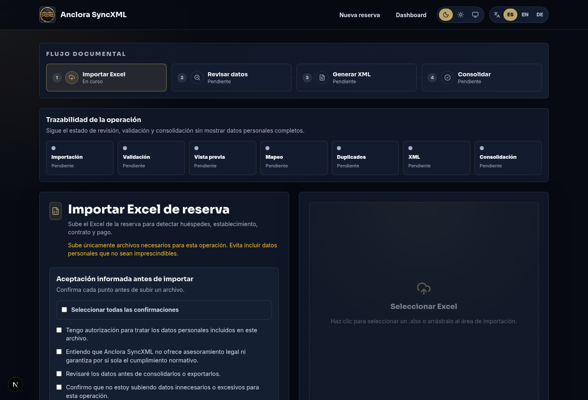
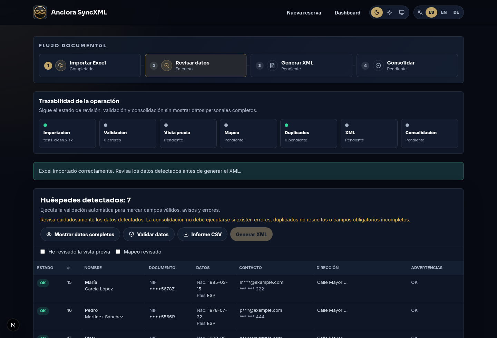
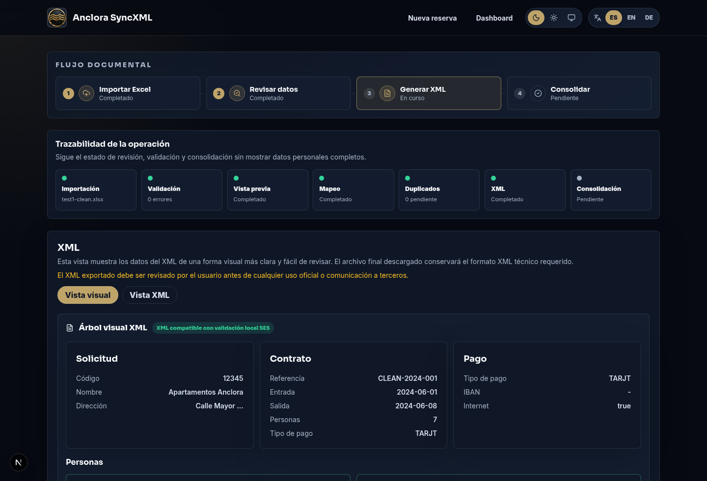
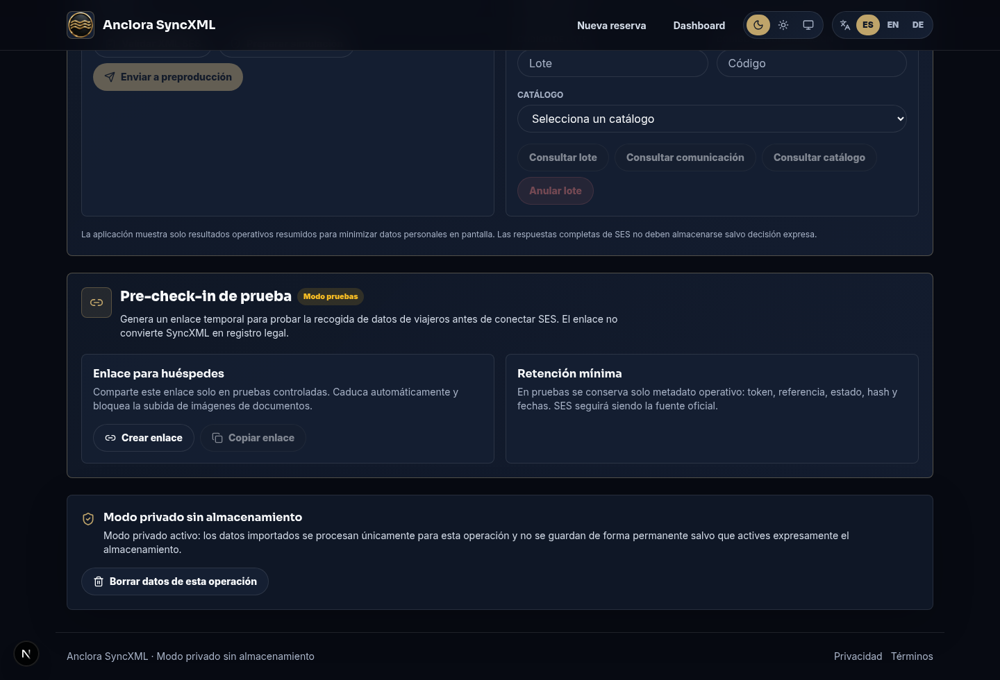
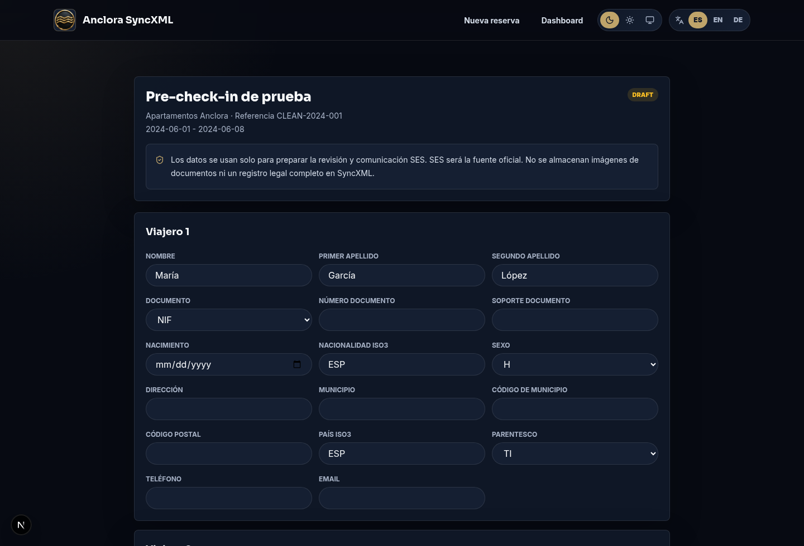
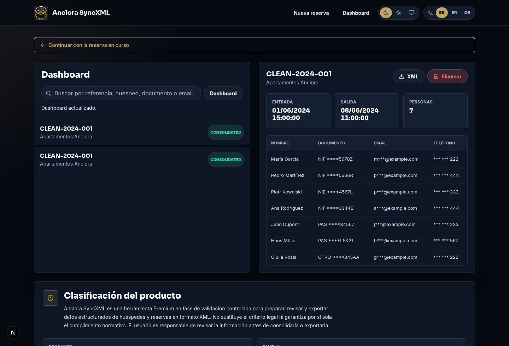

Anclora SyncXML

Manual de Usuario

Guia practica para importar reservas, validar datos de huespedes, generar XML y preparar pruebas SES

  
Version 1.0

  
24 mayo 2026

SyncXML prepara, valida y exporta datos estructurados para el flujo SES.HOSPEDAJES. No sustituye la revision humana ni el criterio legal del responsable del tratamiento.

## Indice

| No. | Seccion | Pagina |
| --- | --- | ---: |
| 01 | Que es Anclora SyncXML | 3 |
| 02 | Antes de empezar | 5 |
| 03 | Flujo documental | 6 |
| 04 | Revision y validacion inteligente | 9 |
| 05 | Generacion, revision y descarga XML | 12 |
| 06 | Servicios SES y pre-check-in de prueba | 15 |
| 07 | Dashboard e historial operativo | 18 |
| 08 | Privacidad, seguridad y buenas practicas | 21 |
| 09 | Preguntas frecuentes | 23 |
| 10 | Glosario rapido | 25 |

## 1. Que es Anclora SyncXML

**Anclora SyncXML** es una aplicacion premium para transformar el Excel de una reserva en un XML revisable, validado y preparado para el flujo operativo de SES.HOSPEDAJES.

La aplicacion esta pensada para trabajar con datos sensibles de huespedes con un enfoque de minimizacion: primero se revisa, despues se corrige y solo al final se genera o descarga el XML.

### Para que sirve

| Necesidad | Como ayuda SyncXML |
| --- | --- |
| Importar reservas | Lee el Excel y detecta reserva, establecimiento, pago y viajeros. |
| Validar datos | Marca errores y avisos antes de generar XML. |
| Corregir campos | Permite completar datos SES obligatorios desde una revision guiada. |
| Generar XML | Crea un XML por reserva con nombre normalizado y fecha. |
| Revisar antes de enviar | Muestra una vista visual y el XML tecnico. |
| Preparar SES | Incluye validacion local, simulacion y controles de preproduccion. |
| Probar pre-check-in | Genera enlaces temporales de prueba para completar datos de viajeros. |

### Que no hace

- No sustituye el portal ni los servicios oficiales de SES.
- No debe usarse como registro legal completo si SES es la fuente oficial.
- No almacena imagenes de DNI o pasaporte.
- No envia a produccion sin configuracion y evidencia de pruebas previas.

---

## 2. Antes de empezar

Antes de usar SyncXML conviene tener claro el alcance de la operacion.

### Necesitas

- Excel de la reserva en formato `.xlsx`.
- Autorizacion para tratar los datos personales incluidos en el archivo.
- Datos de establecimiento y codigo si van a comunicarse a SES.
- Datos de viajeros completos: documento, nacimiento, nacionalidad, direccion, contacto y relacion.
- Criterio interno sobre quien revisa y aprueba el XML antes de usarlo oficialmente.

### Recomendaciones

| Punto | Recomendacion |
| --- | --- |
| Entorno | Trabaja en una pantalla privada y evita compartir datos personales innecesarios. |
| Archivo | Sube solo el Excel necesario para la operacion. |
| Revision | No descargues ni consolides si hay errores criticos. |
| SES | Usa primero preproduccion y guarda evidencia de aceptacion/rechazo. |
| Pre-check-in | En pruebas, usa enlaces temporales y evita datos reales si no hay autorizacion. |

---

## 3. Flujo documental

El flujo principal esta dividido en cuatro fases visibles:

| Fase | Objetivo |
| --- | --- |
| Importar Excel | Seleccionar el archivo y aceptar las confirmaciones informadas. |
| Revisar datos | Comprobar viajeros, reserva, contrato y validaciones. |
| Generar XML | Crear el XML y revisarlo visualmente. |
| Consolidar | Guardar la operacion en el modo configurado y permitir descarga posterior. |

La banda de **trazabilidad de la operacion** muestra el estado de importacion, validacion, vista previa, mapeo, duplicados, XML y consolidacion sin exponer datos personales completos.

### Importar un Excel

1. Revisa las confirmaciones informadas.
2. Marca **Seleccionar todas las confirmaciones** o cada casilla individual.
3. Selecciona el archivo `.xlsx`.
4. Pulsa **Importar**.

Si el archivo no es valido, esta vacio, supera el tamano maximo o no se puede leer, la aplicacion muestra un mensaje de error antes de continuar.

---

## 4. Revision y validacion inteligente

La fase de revision permite entender que ha detectado la aplicacion antes de generar ningun XML.

### Elementos principales

| Elemento | Uso |
| --- | --- |
| Tabla de huespedes | Revisa nombre, documento, nacionalidad, contacto y estado de validacion. |
| Mostrar datos completos | Permite ver datos sin enmascarar solo si estas en un entorno privado. |
| Validar datos | Ejecuta la validacion inteligente. |
| Informe CSV | Descarga un informe de incidencias y estado por reserva y viajero. |
| Revision guiada | Completa campos SES obligatorios o corrige avisos. |
| Duplicados | Decide si omitir, mantener o revisar manualmente registros sospechosos. |

### Colores de validacion

| Estado | Significado |
| --- | --- |
| Valido | Campo correcto o suficiente para el flujo actual. |
| Aviso | Conviene revisar, pero no siempre bloquea el XML. |
| Error | Bloquea la generacion, descarga o consolidacion hasta corregirse. |

### Campos que suelen requerir revision

- Codigo de municipio INE para direcciones en Espana.
- Soporte de documento para NIF/NIE.
- Sexo y parentesco.
- Telefono o email de contacto.
- Segundo apellido cuando aplique.
- Codigo postal y direccion.

---

## 5. Generacion, revision y descarga XML

Cuando los errores criticos estan corregidos, pulsa **Generar XML**. La aplicacion crea una vista visual y una vista tecnica.

### Vista visual

La vista visual organiza el XML en bloques:

| Bloque | Contenido |
| --- | --- |
| Solicitud | Codigo de establecimiento, nombre y direccion. |
| Contrato | Referencia, entrada, salida, personas y pago. |
| Pago | Tipo de pago, IBAN enmascarado e internet. |
| Personas | Viajeros incluidos, documento enmascarado y contacto. |

### Vista XML

La vista XML muestra el contenido tecnico que se descargara. Debe revisarse antes de usarlo oficialmente.

### Descarga del XML

El nombre del archivo descargado usa el formato:

`syncxml-numeroReserva-DDMMRRHH24MISS.xml`

La descarga queda bloqueada si existen incidencias criticas en el XML.

---

## 6. Servicios SES y pre-check-in de prueba

SyncXML incluye un panel de servicios SES para trabajar de forma asistida:

| Accion | Descripcion |
| --- | --- |
| Validar XML SES | Ejecuta validacion local contra reglas SES implementadas. |
| Preparar simulacion | Prepara una peticion sin enviar datos al Ministerio. |
| Enviar a preproduccion | Solo disponible si hay credenciales configuradas. |
| Consultar lote/comunicacion | Requiere credenciales de preproduccion. |
| Consultar catalogo | Permite revisar catalogos oficiales cuando SES este configurado. |

La produccion permanece bloqueada hasta completar pruebas controladas.

### Pre-check-in de prueba

El panel de pre-check-in de prueba genera un enlace temporal para completar datos de viajeros antes de la revision.

En este modo:

- El enlace es temporal.
- No se almacenan imagenes de documentos.
- No se crea un registro legal completo.
- Se guarda solo metadato operativo: token, referencia, estado, hash y fechas.
- SES sigue siendo la fuente oficial cuando se realice la comunicacion real.

---

## 7. Dashboard e historial operativo

El dashboard permite buscar reservas, revisar estado y volver a descargar XML cuando el modo de almacenamiento configurado lo permite.

### Tarjetas principales

| Tarjeta | Informacion |
| --- | --- |
| Lista de reservas | Referencia, alojamiento y estado. |
| Detalle | Entrada, salida, personas y viajeros detectados. |
| Acciones | Descargar XML o eliminar la reserva. |
| Clasificacion del producto | Recordatorio del alcance y limites de uso. |

### Fechas

Las fechas se muestran como `DD/MM/RRRR`. Si existe hora, se muestran como `DD/MM/RRRR HH:MM:SS`.

---

## 8. Privacidad, seguridad y buenas practicas

SyncXML trabaja con informacion personal. Usa estas reglas operativas:

| Regla | Motivo |
| --- | --- |
| Minimiza datos | Sube solo lo necesario para la comunicacion. |
| Revisa antes de exportar | Evita errores antes de uso oficial. |
| No guardes imagenes | DNI/pasaporte no deben almacenarse en SyncXML. |
| Usa preproduccion | Prueba SES antes de cualquier operacion real. |
| Borra operaciones temporales | Usa el boton de borrado cuando termines una revision. |
| Controla accesos | Solo usuarios autorizados deben abrir reservas con PII. |

> SyncXML no ofrece asesoramiento legal. El responsable del tratamiento debe aprobar privacidad, DPA, retencion y procedimiento de uso.

---

## 9. Preguntas frecuentes

### Puedo generar XML con errores?

No. Los errores criticos bloquean la generacion, descarga o consolidacion hasta que se corrijan.

### Que ocurre si falta el codigo de municipio?

Para direcciones en Espana, SES exige codigo INE de municipio. La revision guiada permite completarlo.

### Puedo enviar a SES desde la aplicacion?

En preproduccion, cuando existan credenciales y configuracion. Produccion permanece bloqueada por defecto.

### El pre-check-in ya es productivo?

No. Esta implementado en modo pruebas para validar el flujo antes de usar datos reales o activar persistencia.

### Se guardan documentos escaneados?

No. La politica actual bloquea imagenes de DNI y pasaporte.

---

## 10. Glosario rapido

| Termino | Significado |
| --- | --- |
| SES | Sistema oficial usado para comunicaciones de hospedajes. |
| XML | Archivo estructurado que contiene la reserva y viajeros. |
| Preproduccion | Entorno de pruebas antes de produccion. |
| Hash | Huella tecnica que permite identificar un envio sin almacenar todo el contenido. |
| DPA | Contrato de encargado de tratamiento de datos. |
| PII | Informacion personal identificable. |
| INE | Instituto Nacional de Estadistica; fuente de codigos municipales. |

Anclora SyncXML · Manual de Usuario · Version 1.0

